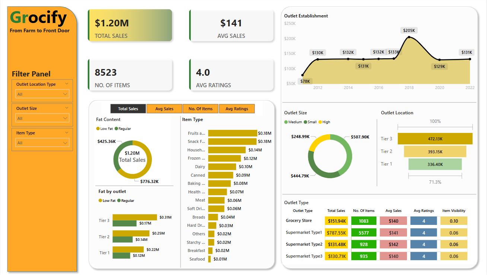

# 🛒 Grocify Sales Dashboard – Power BI Project

This is an end-to-end data analytics project presents a comprehensive analytics report for **Grocify**, a leading quick-commerce grocery delivery platform. The core objective was to evaluate the company's sales performance, customer satisfaction, inventory attributes, and outlet-based segmentation using SQL and Power BI.
The analysis focusses on identifying actionable KPIs and uncovering optimization opportunities across outlets, products, and customer interactions to guide future business strategy.

---

## 🎯 Business Objectives

Grocify stakeholders outlined the following strategic goals:

- Understand how **product characteristics** like item fat content, and item type influence sales.
- Evaluate **customer satisfaction** using customer ratings
- Compare performance across different **outlet characteristics** such as location, size, and establishment year
- Support data-driven **inventory and marketing** decisions

---

## 🧾 KPIs

After carefully analyzing the business requirements and objectives shared by stakeholders, I translated those needs into measurable KPIs that would provide clear insights and support decision-making.

| KPI | Description |
|-----|-------------|
| **Total Sales** | Measures total revenue generated from item sales across all outlets |
| **Average Sales** | Captures mean sales value to identify purchasing patterns |
| **Number of Items** | Tracks volume sold, helpful for inventory and demand planning |
| **Average Customer Rating** | Serves as a proxy for customer satisfaction and product quality |

---

## 📈 Analysis Summary

To better understand what's driving sales and uncover actionable insights to support strategic decision-making, I analyzed the data from multiple angles. The goal was to see how fat content, item type, and outlet characteristis (establisment year, location and size ) affects the KPIs. Following are the area of analysis:

1. **Sales by Fat Content:** Analyzed the impact of fat content on total sales. Also assessed how other KPIs vary with fat content
2. **sales by Item Type:** Identified the performance of different item type in terms of total sales and other KPIs
3. **Fat Content by Outlet for total sales:** Compared the total sales accross different outlets, segmented by fat content. Also assessed the affect of different outlet on other KPIs
4. **Total Sales by Outlet Establishment Year:** Evaluated how outlet establishment year had influenced the total sales.
5. **Sales by Outlet Size and Location:** Analyzed the corelation between sales and outlet size and its location.
6. **All Metrics by Outlet Type:** Provided comprensive views of all key metrics (Total Sales, Average Sales, Number of Item Sold, and Average Rating) broken down by different outlet type.

---

## 🛠️ Tools & Technologies Used

- **Excel** – Quick data validation and exploration 
- **SQL** – Data extraction and querying  
- **Power BI** – Dashboard creation and  interactive reports 
- **GitHub** –Project documentation

---

## 📋 Dashboard Features

- ✅ **Dynamic KPI Cards**: Displaying total sales, item count, average sales per item, and ratings  
- 🎛️ **Interactive Slicers**: Filter by outlet location, size, and item type  
- 📉 **Visualizations**:
  - Year-wise outlet establishment trends (Line Chart)
  - Outlet size contribution to sales (Donut Chart)
  - Sales by outlet location, fat content, and item category (Bar Charts)
  - Summary of performance by outlet type (Data Table)

---

## 🔍 Key Insights

- 🏙️ **Tier 3** cities recorded the highest overall sales.
- 🛒 **Supermarket Type 1** emerged as the leading outlet type by volume.
- 📦 **Medium-sized outlets** accounted for over **50%** of total sales.
- 🧈 Items with **high fat content** outperformed low-fat alternatives in sales.

---

## 💼 Business Value

This dashboard offers decision-makers the ability to:

- Analyze product and outlet performance with ease
- Identify high-performing categories and underperforming segments
- Align inventory strategy with sales trends
- Drive regional marketing and expansion decisions based on data

---

## 🖼️ Dashboard Preview

---

## 📁 Project Files

- [`Grocify_Sales_Dashboard.pbix`](Grocify.pbix) – Power BI dashboard file

---

## 📬 Contact

**Chandra Kishor Mandal**  
*Aspiring Data Analyst | B.Tech in Industrial & Production Engineering (NIT Jalandhar)*  
📧 chandrakishorrv@gmail.com  
📍 India  
🔗 [LinkedIn – @chandrakishor06](https://www.linkedin.com/in/chandrakishor06)

---
